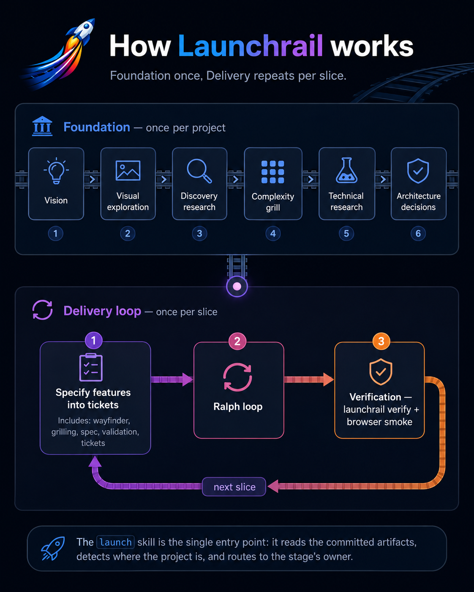

<div align="center">


# Launchrail

**An updatable development system for taking a software idea from product intent to a verified release.**

[](https://github.com/wemuda/launchrail/actions/workflows/ci.yml)
[](https://github.com/wemuda/launchrail/releases)
[](package.json)
[](pnpm-workspace.yaml)
[](docs/adr/0002-conventional-commits.md)
[](LICENSE)

[How it works](#how-it-works) ·
[Getting started](docs/getting-started.md) ·
[Using it](#using-it-in-your-project) ·
[Updating](#updating-a-project) ·
[Ownership model](#the-ownership-model) ·
[Repository layout](#repository-layout) ·
[Contributing](#contributing) ·
[Credits](#credits)

</div>

---

This repository is the Launchrail **toolchain**: the CLI, the workflow skills (vendored into projects as files), templates, and migrations that initialize other repositories and keep them current. It is not an application framework and it does not replace Claude Code, Claude Design, [Matt Pocock's skills](https://github.com/mattpocock/skills), GitHub, Playwright, or a project's chosen stack. It is the shared rail that connects them.

## How it works

Launchrail structures development as two movements. The **foundation** runs once per project: it turns an idea into hard constraints and recorded decisions. Then the **delivery loop** takes over — once per feature: size the work and plan it only as deeply as it needs (a small change goes straight from a grill to tickets; a larger one adds `wayfinder`, a spec, and design validation first), then hand the tickets to the project's **implementation loop** — the built-in Ralph loop by default, or another the project selects — to implement and verify before going around again for the next feature. Every stage leaves a committed artifact behind, and the next stage starts from that artifact, not from chat memory. Two commands cover the rail: **`/launch`** plans — it reads the committed artifacts, detects where the project is, and routes to the stage's owner — and **`/launch-implement`** builds, driving ready tickets to verified merges.

<p align="center">
  
</p>

Several stages run directly on [Matt Pocock's skills](https://github.com/mattpocock/skills) — see [Credits](#credits). The full stage contract — inputs, artifacts, composition rules, and per-mode rigor — lives in [the workflow doc](packages/cli/assets/skills/launchrail/launch/workflow.md).

What makes projects **updatable** instead of copy-once-and-rot is the second half of the system: shared capabilities are *vendored as managed files and kept current on `sync`*, shared standards are *synchronized*, product knowledge stays *locally owned*, and reusable lessons are *deliberately promoted upstream*.

## Using it in your project

One command sets the rails:

```bash
npx @wemuda/launchrail init
```

`init` interviews you (or takes `--yes`), runs `git init` if the directory isn't a repository yet, seeds `AGENTS.md` and ADR conventions without touching existing content, and vendors the workflow's skills into `.claude/skills/` as managed files — so every collaborator, and every session whether cloud or local, gets the same skills with no plugin to install, on any agent that reads the repo ([ADR-0019](docs/adr/0019-vendor-skills-retire-plugin.md)). Adopting an existing project is a first-class path: your files are kept, and a `CLAUDE.md` you already have is additively wired to the workflow imports rather than replaced ([ADR-0012](docs/adr/0012-init-wires-imports-into-existing-claude-md.md)). The interview asks whether the project is new or existing and records it as the manifest's `origin`; for an existing project, `launch` takes an **alignment on-ramp** — inferring a draft vision from the code, interviewing only the gaps, and inventorying your existing design system — instead of starting from a blank vision ([ADR-0013](docs/adr/0013-existing-project-alignment.md)).

From there, the day-to-day driver is not the CLI — it's the **`launch` skill** inside Claude Code: open the project and run `/launch`. Invoke it (or just ask "what's next?") and it reads your committed artifacts, works out where the project is — no vision yet, mid-grill, spec validated, tickets ready — and runs or routes to the next stage's owner. Give it a stage name (`launch design-validation`) to jump straight there. The vendored skills carry the rest of the workflow too:

- **`launch-project-alignment`** — the on-ramp for an existing codebase: infer a vision from the code, interview only the gaps, inventory the design system, then join the loop
- **`launch-vision-creation`** and **`launch-design-validation`** — the Launchrail-owned stages of the pipeline
- **`launch-browser-smoke`** — drives a real browser journey and leaves a traceable evidence bundle (with the browser-testing module)
- **`launch-implement`** — the one door to building: `/launch-implement` drives ready tickets to verified merges through the selected loop (a ticket number builds just that one; "the next 5 of spec #2" scopes and caps a run)
- **`launch-ralph`**, **`launch-ralph-implement`**, **`launch-resolving-merge-conflicts`** — the verification-gated loop engine behind that door, vendored by `init`

The CLI is the maintenance surface you return to between sessions:

```bash
npx @wemuda/launchrail status                # versions, drift, pending migrations
npx @wemuda/launchrail diff                  # preview upstream changes
npx @wemuda/launchrail sync                  # apply managed updates + run migrations
npx @wemuda/launchrail add browser-testing   # enable a module
npx @wemuda/launchrail doctor                # repository and environment checks
npx @wemuda/launchrail verify                # deterministic verification gate
npx @wemuda/launchrail smoke                 # scaffold a browser-smoke evidence bundle
npx @wemuda/launchrail eject <module|file>   # opt out of management (vendor mode: --all)
```

Initialized projects carry two files: `.launchrail.yml` (configuration) and `.launchrail-lock.json` (versions, checksums, applied migrations; committed to the repo). Full walkthrough: [docs/getting-started.md](docs/getting-started.md). Committed, unedited example of what `init` produces: [examples/hello-launchrail](examples/hello-launchrail).

## Updating a project

New Launchrail release out? Two steps, from the project root:

**1. Sync the project files** — applies the release's managed files (the workflow skills included) and migrations; your own files are never touched:

```bash
npx -y @wemuda/launchrail@latest sync
```

**2. Commit the result:**

```bash
git add -A && git commit -m "chore: sync launchrail"
```

Done — the skills update *with* the files in one `sync` (no separate plugin step, and teammates just `git pull`), and the next `/launch` runs with everything the release added (the [CHANGELOG](CHANGELOG.md) says what that is). Keep the `@latest`: `npx` caches, and a stale cached CLI reports "everything up to date" against old templates. Want to see the changes before applying? `npx -y @wemuda/launchrail@latest diff` — read-only, like `status` and `sync --dry-run`. The why and the edge cases — ordering, conflicts, migrations — live in [docs/getting-started.md](docs/getting-started.md#updating-to-a-new-release).

## The ownership model

Every file Launchrail touches in a consuming project belongs to exactly one class — and no feature is allowed to blur the lines:

| Class | Who owns it | What Launchrail may do |
| --- | --- | --- |
| **Managed** | Launchrail | Replace it on `sync` |
| **Seeded** | The project, after creation | Create it once, then never touch it |
| **Project-owned** | The project, always | Nothing |

Every write supports dry-run, is checksum-aware, and is idempotent: re-running `init` or `sync` never duplicates blocks or destroys local work. A managed file you edit locally keeps your edits — `sync` reports the conflict instead of overwriting — and `launchrail eject` permanently opts a file or module out of management ([ADR-0006](docs/adr/0006-sync-engine.md)).

## Repository layout

```text
launchrail/
├── assets/                  # Logo and other repo media
├── packages/
│   └── cli/                 # @wemuda/launchrail — the npx entry point
│       └── assets/skills/   # Vendored workflow skills: launchrail/ (own, launch-*) + vendor/ (pinned MIT upstream)
├── templates/               # Files seeded into consuming projects (added as built)
├── examples/
│   └── hello-launchrail/    # Committed, unedited output of `launchrail init` on a tiny app
└── docs/
    ├── adr/                 # Architecture decision records
    ├── getting-started.md   # Installation and day-2 guide
    └── releasing.md         # How releases are cut
```

Directories marked "added as built" are created when their first real content lands.

## Development

Requires Node ≥ 22 and pnpm.

```bash
pnpm install
pnpm build
pnpm --filter @wemuda/launchrail exec launchrail --help
```

## Status

The toolchain is stable and versioned. The full surface — `init`/`doctor`, the vendored workflow skills, browser testing, the Ralph loop, and the sync engine — is covered by 178 tests, including integration tests against real temporary Git repositories. Releases are automated: Conventional Commits drive release-please, and the changelog is generated from the commit history ([ADR-0008](docs/adr/0008-release-automation.md), [docs/releasing.md](docs/releasing.md)). The CLI is published to npm as [`@wemuda/launchrail`](https://www.npmjs.com/package/@wemuda/launchrail). Shipped history lives in [CHANGELOG.md](CHANGELOG.md).

## Contributing

See [CONTRIBUTING.md](CONTRIBUTING.md). The short version:

- Commits follow [Conventional Commits](https://www.conventionalcommits.org/) (`type(scope): summary`); see [ADR-0002](docs/adr/0002-conventional-commits.md). Releases and the changelog are generated from them ([docs/releasing.md](docs/releasing.md)).
- Meaningful decisions are recorded as ADRs in [docs/adr/](docs/adr/).
- The agent operating contract lives in [AGENTS.md](AGENTS.md).
- Security issues go through [SECURITY.md](SECURITY.md), not public issues.

## Credits

Launchrail doesn't reinvent a workflow — it composes one, and much of that workflow is [**Matt Pocock**](https://www.mattpocock.com/)'s. Four stages of the pipeline (complexity grill, technical research, MVP specification, tickets) run directly on his [`skills`](https://github.com/mattpocock/skills) repository — `grill-with-docs`, the research skill, `wayfinder`/`to-spec`, and `to-tickets`. Launchrail exists to wire those skills into a repo cleanly and keep them updatable, not to replace them.

If Launchrail is useful to you, the credit belongs upstream first: star [`mattpocock/skills`](https://github.com/mattpocock/skills), watch [Matt's YouTube channel](https://www.youtube.com/@mattpocockuk), follow [@mattpocockuk on X](https://x.com/mattpocockuk), and check out [AI Hero](https://www.aihero.dev/).

## License

[MIT](LICENSE) ([ADR-0007](docs/adr/0007-mit-license.md)). Everything Launchrail writes into *your* repository — seeded files, managed files, rendered templates — is yours, with no attribution or license obligation attached.
