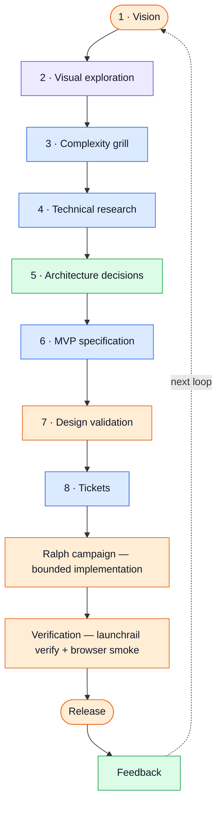
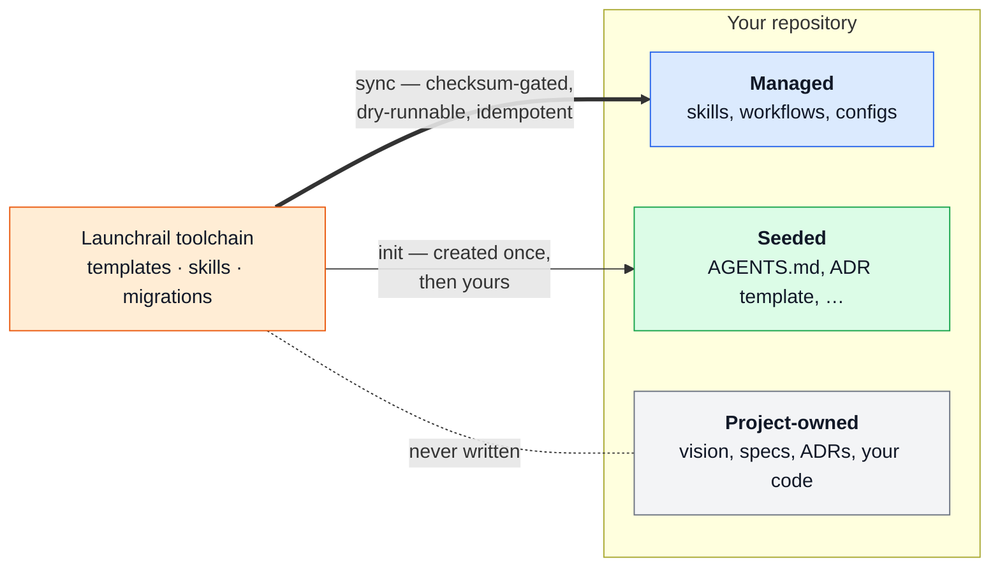

<div align="center">


# Launchrail

**An updatable development system for taking a software idea from product intent to a verified release.**

[](https://github.com/wemuda/launchrail/actions/workflows/ci.yml)
[](ROADMAP.md)
[](package.json)
[](pnpm-workspace.yaml)
[](docs/adr/0002-conventional-commits.md)
[](LICENSE)

[How it works](#how-it-works) ·
[Getting started](docs/getting-started.md) ·
[Usage](#usage-in-a-consuming-project) ·
[Ownership model](#the-ownership-model) ·
[Repository layout](#repository-layout) ·
[Roadmap](ROADMAP.md) ·
[Contributing](#contributing)

</div>

---

> **Status:** Pre-release. All six roadmap phases are implemented; nothing is published to npm yet.

This repository is the Launchrail **toolchain**: the CLI, Claude Code plugin, templates, and migrations that initialize other repositories and keep them current. It is not an application framework and it does not replace Claude Code, Claude Design, [Matt Pocock's skills](https://github.com/mattpocock/skills), GitHub, Playwright, or a project's chosen stack. It is the shared rail that connects them.

## Credits

Launchrail doesn't reinvent a workflow — it composes one, and most of that workflow is [**Matt Pocock**](https://www.mattpocock.com/)'s. Four of the eight stages in the pipeline below (complexity grill, technical research, MVP specification, tickets) run directly on his [`skills`](https://github.com/mattpocock/skills) repository — `grill-with-docs`, the research skill, `wayfinder`/`to-spec`, and `to-tickets`. Launchrail exists to wire those skills into a repo cleanly and keep them updatable, not to replace them.

If Launchrail is useful to you, the credit belongs upstream first: star [`mattpocock/skills`](https://github.com/mattpocock/skills), watch [Matt's YouTube channel](https://www.youtube.com/@mattpocockuk), follow [@mattpocockuk on X](https://x.com/mattpocockuk), and check out [AI Hero](https://www.aihero.dev/).

## How it works

Launchrail structures the path from idea to release as an explicit pipeline. Every stage is owned by exactly one tool and leaves a committed artifact behind — the next stage starts from that artifact, not from chat memory. The `launch` skill is the single entry point: it reads the committed artifacts, detects where the project is, and routes to the owner of the next stage.



<div align="center">

**Stage owner:** &nbsp; 🟧 Launchrail &nbsp;·&nbsp; 🟦 [Matt Pocock's skills](https://github.com/mattpocock/skills) &nbsp;·&nbsp; 🟪 Claude Design &nbsp;·&nbsp; 🟩 Your project

</div>

The full stage contract — inputs, artifacts, composition rules, and per-mode rigor — lives in [the workflow doc](plugins/launchrail/docs/workflow.md).

What makes projects **updatable** instead of copy-once-and-rot is the second half of the system: shared capabilities are *subscribed to*, shared standards are *synchronized*, product knowledge stays *locally owned*, and reusable lessons are *deliberately promoted upstream*.

## Usage (in a consuming project)

Full walkthrough: [docs/getting-started.md](docs/getting-started.md). Committed example of what `init` produces: [examples/hello-launchrail](examples/hello-launchrail).

```bash
# Initialize a new or existing repository
npx @wemuda/launchrail init

# Inspect versions, enabled modules, drift, and missing requirements
npx @wemuda/launchrail status

# Preview upstream changes
npx @wemuda/launchrail diff

# Synchronize managed capabilities and run migrations
npx @wemuda/launchrail sync

# Add a module later
npx @wemuda/launchrail add browser-testing
npx @wemuda/launchrail add ralph

# Validate the repository and environment
npx @wemuda/launchrail doctor

# Run the deterministic verification contract
npx @wemuda/launchrail verify

# Scaffold an evidence bundle for an agentic browser smoke run
npx @wemuda/launchrail smoke

# Stop managing a file or module (vendor mode: --all)
npx @wemuda/launchrail eject <module|file>
```

Initialized projects carry two files: `.launchrail.yml` (configuration) and `.launchrail-lock.json` (versions, checksums, applied migrations; committed to the repo).

## The ownership model

Every file Launchrail touches in a consuming project belongs to exactly one class — and no feature is allowed to blur the lines:



| Class | Who owns it | What Launchrail may do |
| --- | --- | --- |
| **Managed** | Launchrail | Replace it on `sync` |
| **Seeded** | The project, after creation | Create it once, then never touch it |
| **Project-owned** | The project, always | Nothing |

Every write supports dry-run, is checksum-aware, and is idempotent: re-running `init` or `sync` never duplicates blocks or destroys local work. A managed file you edit locally keeps your edits — `sync` reports the conflict instead of overwriting — and `launchrail eject` permanently opts a file or module out of management ([ADR-0006](docs/adr/0006-sync-engine.md)).

## Repository layout

```text
launchrail/
├── assets/                  # Logo and other repo media
├── packages/
│   └── cli/                 # @wemuda/launchrail — the npx entry point
├── plugins/
│   └── launchrail/          # Claude Code plugin (skills, commands, agents, hooks)
├── .claude-plugin/
│   └── marketplace.json     # Claude Code plugin marketplace manifest
├── templates/               # Files seeded into consuming projects (added as built)
├── examples/
│   └── hello-launchrail/    # Committed, unedited output of `launchrail init` on a tiny app
└── docs/
    ├── adr/                 # Architecture decision records
    ├── getting-started.md   # Installation and day-2 guide
    └── releasing.md         # How releases are cut
```

Directories marked "added as built" are created when their first real content lands.

## Development

Requires Node ≥ 22 and pnpm.

```bash
pnpm install
pnpm build
pnpm --filter @wemuda/launchrail exec launchrail --help
```

## Roadmap

See [ROADMAP.md](ROADMAP.md), a living checklist of what exists, what's in progress, and what's missing. All six phases — `init` + `doctor`, the core workflow plugin, browser testing, Ralph orchestration, the sync engine, and open-source readiness — are implemented and covered by 118 tests. What stands between here and a first release: dogfooding the toolchain on a real project (a Ralph campaign and a case study) and flipping on the npm publish.

## Contributing

See [CONTRIBUTING.md](CONTRIBUTING.md). The short version:

- Commits follow [Conventional Commits](https://www.conventionalcommits.org/) (`type(scope): summary`); see [ADR-0002](docs/adr/0002-conventional-commits.md). Releases and the changelog are generated from them ([docs/releasing.md](docs/releasing.md)).
- Meaningful decisions are recorded as ADRs in [docs/adr/](docs/adr/).
- The agent operating contract lives in [AGENTS.md](AGENTS.md).
- Security issues go through [SECURITY.md](SECURITY.md), not public issues.

## License

[MIT](LICENSE) ([ADR-0007](docs/adr/0007-mit-license.md)). Everything Launchrail writes into *your* repository — seeded files, managed files, rendered templates — is yours, with no attribution or license obligation attached.
